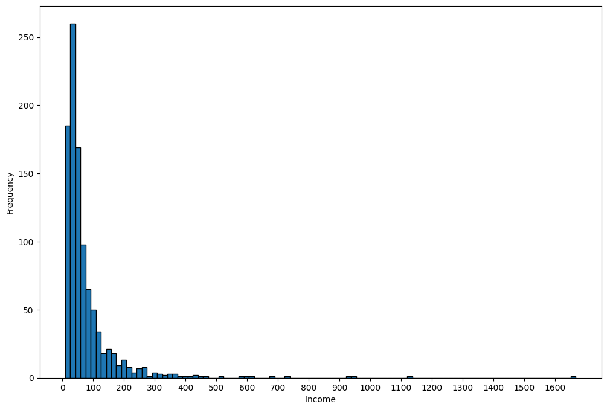
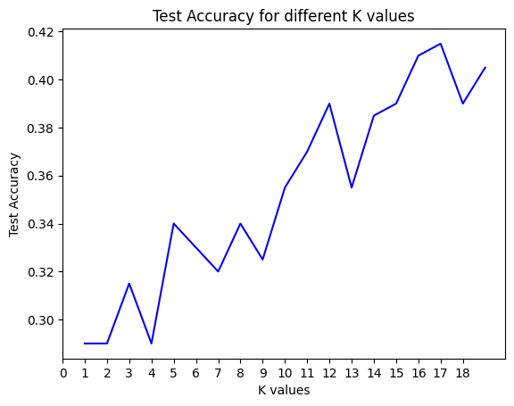

## Classification 
<p>In machine learning classification is a supervised learning approach which can be thought of as a means of categorizing or classifying some unknown items into a discrete set of classes. Classification attempts to learn the relationship between a set of feature variables and a target variable of interest. The target attribute in classification is a categorical variable with discrete values. Some of the popular classification algorithms in machine learning are decision trees, naive bayes, linear discriminant analysis, k-nearest neighbor, logistic regression, neural networks, and support vector machines.</p>

### K-Nearest Neighbours
<p>The K-Nearest Neighbors algorithm is a classification algorithm that takes a bunch of labeled points and uses them to learn how to label other points. This algorithm classifies cases based on their similarity to other cases. In K-Nearest Neighbors, data points that are near each other are said to be neighbors. K-Nearest Neighbors is based on this paradigm. Similar cases with the same class labels are near each other. Thus, the distance between two cases is a measure of their dissimilarity.</p>
Steps:
<ol>
    <li>Pick a value for K.</li>
    <li>Calculate the distance of unknown case from all cases.</li>
<li>Select the K-observations in the training data that are nearest to the unknown data point.</li>
<li>Predict the response from the unknown data point using the most popular response value from the K-nearest neighbors.</li>
</ol>
<p>To calculate the similarity or distance of unknown case from all cases, we can use Euclidian distance or some other formulae in different dimensional space. KNN can also be used for regression.</p>

### KNN Regression
<p> The output value or predicted value is the average of K nearest neighbours. </p>

<p>KNN is a type of instance-based learning or lazy learning. Lazy learning means it does not require any training data points for model generation. All training data will be used in the testing phase. This makes training faster and testing slower and costlier. So, the testing phase requires more time and memory resources.</p>

<p>In kNN, the neighbours are taken from a set of objects for which the class or the object property value is known. This can be thought of as the training set for the kNN algorithm, though no explicit training step is required. In both classification and regression kNN algorithm, we can assign weight to the contributions of the neighbours. So, nearest neighbours contribute more to the average than the more distant ones.</p>

### Deciding the number of neighbors (K) in kNN
<p>The number of neighbours (k) in kNN is a parameter that we need to select at the time of model building. Selecting the optimal value of k in kNN is the most critical problem. A small value of k means that noise will have higher influence on the result. So, probability of overfitting is very high. A large value of k makes it computationally expensive in terms of time to build the kNN model. Also, a large value of k will have a smoother decision boundary which means lower variance but higher bias.To optimize the results, we can use Cross Validation technique. Using the cross-validation technique, we can test the kNN algorithm with different values of k. The model which gives good accuracy can be considered to be an optimal choice. It depends on individual cases and at times best process is to run through each possible value of k and test our result.</p>

## Evaluation Metrics in Classification  
<p>Evaluation metrics provide a key role in the development of a model, as they provide insight to areas that might require improvement. There are different model evaluation metrics, some of the important onces are: Jaccard index, F1-score, and Log Loss. 

## Classification Task
Imagine a telecommunications provider has segmented its customer base by service usage patterns, categorizing the customers into four groups. If demographic data can be used to predict group membership, the company can customize offers for individual prospective customers. It is a classification problem. That is, given the dataset, with predefined labels, we need to build a model to be used to predict class of a new or unknown case.
The example focuses on using demographic data, such as region, age, and marital, to predict usage patterns.

The target field, called custcat, has four possible values that correspond to the four customer groups, as follows: 1- Basic Service 2- E-Service 3- Plus Service 4- Total Service

Our objective is to build a classifier, to predict the class of unknown cases. We will use a specific type of classification called K nearest neighbour


```python
import numpy as np 
import pandas as pd
```


```python
df = pd.read_csv('teleCust1000t.csv')
df.head()
```


<div>
<style scoped>
    .dataframe tbody tr th:only-of-type {
        vertical-align: middle;
    }

    .dataframe tbody tr th {
        vertical-align: top;
    }

    .dataframe thead th {
        text-align: right;
    }
</style>
<table border="1" class="dataframe">
  <thead>
    <tr style="text-align: right;">
      <th></th>
      <th>region</th>
      <th>tenure</th>
      <th>age</th>
      <th>marital</th>
      <th>address</th>
      <th>income</th>
      <th>ed</th>
      <th>employ</th>
      <th>retire</th>
      <th>gender</th>
      <th>reside</th>
      <th>custcat</th>
    </tr>
  </thead>
  <tbody>
    <tr>
      <th>0</th>
      <td>2</td>
      <td>13</td>
      <td>44</td>
      <td>1</td>
      <td>9</td>
      <td>64.0</td>
      <td>4</td>
      <td>5</td>
      <td>0.0</td>
      <td>0</td>
      <td>2</td>
      <td>1</td>
    </tr>
    <tr>
      <th>1</th>
      <td>3</td>
      <td>11</td>
      <td>33</td>
      <td>1</td>
      <td>7</td>
      <td>136.0</td>
      <td>5</td>
      <td>5</td>
      <td>0.0</td>
      <td>0</td>
      <td>6</td>
      <td>4</td>
    </tr>
    <tr>
      <th>2</th>
      <td>3</td>
      <td>68</td>
      <td>52</td>
      <td>1</td>
      <td>24</td>
      <td>116.0</td>
      <td>1</td>
      <td>29</td>
      <td>0.0</td>
      <td>1</td>
      <td>2</td>
      <td>3</td>
    </tr>
    <tr>
      <th>3</th>
      <td>2</td>
      <td>33</td>
      <td>33</td>
      <td>0</td>
      <td>12</td>
      <td>33.0</td>
      <td>2</td>
      <td>0</td>
      <td>0.0</td>
      <td>1</td>
      <td>1</td>
      <td>1</td>
    </tr>
    <tr>
      <th>4</th>
      <td>2</td>
      <td>23</td>
      <td>30</td>
      <td>1</td>
      <td>9</td>
      <td>30.0</td>
      <td>1</td>
      <td>2</td>
      <td>0.0</td>
      <td>0</td>
      <td>4</td>
      <td>3</td>
    </tr>
  </tbody>
</table>
</div>


```python
df.describe()
```


<div>
<style scoped>
    .dataframe tbody tr th:only-of-type {
        vertical-align: middle;
    }

    .dataframe tbody tr th {
        vertical-align: top;
    }

    .dataframe thead th {
        text-align: right;
    }
</style>
<table border="1" class="dataframe">
  <thead>
    <tr style="text-align: right;">
      <th></th>
      <th>region</th>
      <th>tenure</th>
      <th>age</th>
      <th>marital</th>
      <th>address</th>
      <th>income</th>
      <th>ed</th>
      <th>employ</th>
      <th>retire</th>
      <th>gender</th>
      <th>reside</th>
      <th>custcat</th>
    </tr>
  </thead>
  <tbody>
    <tr>
      <th>count</th>
      <td>1000.0000</td>
      <td>1000.000000</td>
      <td>1000.000000</td>
      <td>1000.000000</td>
      <td>1000.000000</td>
      <td>1000.000000</td>
      <td>1000.000000</td>
      <td>1000.000000</td>
      <td>1000.000000</td>
      <td>1000.000000</td>
      <td>1000.000000</td>
      <td>1000.000000</td>
    </tr>
    <tr>
      <th>mean</th>
      <td>2.0220</td>
      <td>35.526000</td>
      <td>41.684000</td>
      <td>0.495000</td>
      <td>11.551000</td>
      <td>77.535000</td>
      <td>2.671000</td>
      <td>10.987000</td>
      <td>0.047000</td>
      <td>0.517000</td>
      <td>2.331000</td>
      <td>2.487000</td>
    </tr>
    <tr>
      <th>std</th>
      <td>0.8162</td>
      <td>21.359812</td>
      <td>12.558816</td>
      <td>0.500225</td>
      <td>10.086681</td>
      <td>107.044165</td>
      <td>1.222397</td>
      <td>10.082087</td>
      <td>0.211745</td>
      <td>0.499961</td>
      <td>1.435793</td>
      <td>1.120306</td>
    </tr>
    <tr>
      <th>min</th>
      <td>1.0000</td>
      <td>1.000000</td>
      <td>18.000000</td>
      <td>0.000000</td>
      <td>0.000000</td>
      <td>9.000000</td>
      <td>1.000000</td>
      <td>0.000000</td>
      <td>0.000000</td>
      <td>0.000000</td>
      <td>1.000000</td>
      <td>1.000000</td>
    </tr>
    <tr>
      <th>25%</th>
      <td>1.0000</td>
      <td>17.000000</td>
      <td>32.000000</td>
      <td>0.000000</td>
      <td>3.000000</td>
      <td>29.000000</td>
      <td>2.000000</td>
      <td>3.000000</td>
      <td>0.000000</td>
      <td>0.000000</td>
      <td>1.000000</td>
      <td>1.000000</td>
    </tr>
    <tr>
      <th>50%</th>
      <td>2.0000</td>
      <td>34.000000</td>
      <td>40.000000</td>
      <td>0.000000</td>
      <td>9.000000</td>
      <td>47.000000</td>
      <td>3.000000</td>
      <td>8.000000</td>
      <td>0.000000</td>
      <td>1.000000</td>
      <td>2.000000</td>
      <td>3.000000</td>
    </tr>
    <tr>
      <th>75%</th>
      <td>3.0000</td>
      <td>54.000000</td>
      <td>51.000000</td>
      <td>1.000000</td>
      <td>18.000000</td>
      <td>83.000000</td>
      <td>4.000000</td>
      <td>17.000000</td>
      <td>0.000000</td>
      <td>1.000000</td>
      <td>3.000000</td>
      <td>3.000000</td>
    </tr>
    <tr>
      <th>max</th>
      <td>3.0000</td>
      <td>72.000000</td>
      <td>77.000000</td>
      <td>1.000000</td>
      <td>55.000000</td>
      <td>1668.000000</td>
      <td>5.000000</td>
      <td>47.000000</td>
      <td>1.000000</td>
      <td>1.000000</td>
      <td>8.000000</td>
      <td>4.000000</td>
    </tr>
  </tbody>
</table>
</div>


```python
df.info()

```

    <class 'pandas.core.frame.DataFrame'>
    RangeIndex: 1000 entries, 0 to 999
    Data columns (total 12 columns):
     #   Column   Non-Null Count  Dtype  
    ---  ------   --------------  -----  
     0   region   1000 non-null   int64  
     1   tenure   1000 non-null   int64  
     2   age      1000 non-null   int64  
     3   marital  1000 non-null   int64  
     4   address  1000 non-null   int64  
     5   income   1000 non-null   float64
     6   ed       1000 non-null   int64  
     7   employ   1000 non-null   int64  
     8   retire   1000 non-null   float64
     9   gender   1000 non-null   int64  
     10  reside   1000 non-null   int64  
     11  custcat  1000 non-null   int64  
    dtypes: float64(2), int64(10)
    memory usage: 93.9 KB


```python
rows, columns = df.shape
print("Rows:",rows)
print("Columns:",columns)
```

    Rows: 1000
    Columns: 12


```python
df["custcat"].value_counts()
df["income"].max()
```


    1668.0


```python
import matplotlib.pyplot as plt
```


```python
plt.figure(figsize=(12,8))
plt.hist(x = df['income'], bins=100, edgecolor = 'black')
plt.xlabel("Income")
plt.ylabel("Frequency")
plt.xticks(range(0,int(df["income"].max()), 100))
plt.show()
```


    

    


```python
#Dividing the dataset into input features and output (target)
X = df.drop(columns = 'custcat', axis = 1)
y = df['custcat']
```


```python
X.head()
```


<div>
<style scoped>
    .dataframe tbody tr th:only-of-type {
        vertical-align: middle;
    }

    .dataframe tbody tr th {
        vertical-align: top;
    }

    .dataframe thead th {
        text-align: right;
    }
</style>
<table border="1" class="dataframe">
  <thead>
    <tr style="text-align: right;">
      <th></th>
      <th>region</th>
      <th>tenure</th>
      <th>age</th>
      <th>marital</th>
      <th>address</th>
      <th>income</th>
      <th>ed</th>
      <th>employ</th>
      <th>retire</th>
      <th>gender</th>
      <th>reside</th>
    </tr>
  </thead>
  <tbody>
    <tr>
      <th>0</th>
      <td>2</td>
      <td>13</td>
      <td>44</td>
      <td>1</td>
      <td>9</td>
      <td>64.0</td>
      <td>4</td>
      <td>5</td>
      <td>0.0</td>
      <td>0</td>
      <td>2</td>
    </tr>
    <tr>
      <th>1</th>
      <td>3</td>
      <td>11</td>
      <td>33</td>
      <td>1</td>
      <td>7</td>
      <td>136.0</td>
      <td>5</td>
      <td>5</td>
      <td>0.0</td>
      <td>0</td>
      <td>6</td>
    </tr>
    <tr>
      <th>2</th>
      <td>3</td>
      <td>68</td>
      <td>52</td>
      <td>1</td>
      <td>24</td>
      <td>116.0</td>
      <td>1</td>
      <td>29</td>
      <td>0.0</td>
      <td>1</td>
      <td>2</td>
    </tr>
    <tr>
      <th>3</th>
      <td>2</td>
      <td>33</td>
      <td>33</td>
      <td>0</td>
      <td>12</td>
      <td>33.0</td>
      <td>2</td>
      <td>0</td>
      <td>0.0</td>
      <td>1</td>
      <td>1</td>
    </tr>
    <tr>
      <th>4</th>
      <td>2</td>
      <td>23</td>
      <td>30</td>
      <td>1</td>
      <td>9</td>
      <td>30.0</td>
      <td>1</td>
      <td>2</td>
      <td>0.0</td>
      <td>0</td>
      <td>4</td>
    </tr>
  </tbody>
</table>
</div>


```python
y.head()
```


    0    1
    1    4
    2    3
    3    1
    4    3
    Name: custcat, dtype: int64


## Normalize the data
Data Standardization gives the data zero mean and unit variance.Standardization is a common preprocessing step in machine learning and statistics to ensure that different features have similar scales. This process is also known as z-score normalization. It is good practice, especially for algorithms such as KNN which is based on the distance of data points.
The fit method computes the mean and standard deviation of each feature in the training data and transform method transforms the data using the rtained scaler.


```python
from sklearn.preprocessing import StandardScaler
scaler = StandardScaler()
X_scaled = scaler.fit_transform(X)
X_scaled[0:5]
```


    array([[-0.02696767, -1.055125  ,  0.18450456,  1.0100505 , -0.25303431,
            -0.12650641,  1.0877526 , -0.5941226 , -0.22207644, -1.03459817,
            -0.23065004],
           [ 1.19883553, -1.14880563, -0.69181243,  1.0100505 , -0.4514148 ,
             0.54644972,  1.9062271 , -0.5941226 , -0.22207644, -1.03459817,
             2.55666158],
           [ 1.19883553,  1.52109247,  0.82182601,  1.0100505 ,  1.23481934,
             0.35951747, -1.36767088,  1.78752803, -0.22207644,  0.96655883,
            -0.23065004],
           [-0.02696767, -0.11831864, -0.69181243, -0.9900495 ,  0.04453642,
            -0.41625141, -0.54919639, -1.09029981, -0.22207644,  0.96655883,
            -0.92747794],
           [-0.02696767, -0.58672182, -0.93080797,  1.0100505 , -0.25303431,
            -0.44429125, -1.36767088, -0.89182893, -0.22207644, -1.03459817,
             1.16300577]])


## Train Test Split 
<p>Out of Sample Accuracy is the percentage of correct predictions that the model makes on data that the model has not been trained on. Doing a train and test on the same dataset will most likely have low out-of-sample accuracy, due to the likelihood of our model overfitting.</p>

<p>It is important that our models have a high, out-of-sample accuracy, because the purpose of any model, of course, is to make correct predictions on unknown data. One of the ways to improve out-of-sample accuracy is to use an evaluation approach called Train/Test Split. Train/Test Split involves splitting the dataset into training and testing sets respectively, which are mutually exclusive. After which, you train with the training set and test with the testing set.</p>

<p>This will provide a more accurate evaluation on out-of-sample accuracy because the testing dataset is not part of the dataset that has been used to train the model. It is more realistic for the real world problem.</p>


```python
from sklearn.model_selection import train_test_split
X_train, X_test, y_train, y_test = train_test_split(X,y, test_size=0.2,random_state=0)
print ('Train set:', X_train.shape,  y_train.shape)
print ('Test set:', X_test.shape,  y_test.shape)
```

    Train set: (800, 11) (800,)
    Test set: (200, 11) (200,)


## kNN Classification 


```python
# training the model 
from sklearn.neighbors import KNeighborsClassifier

k = 4
model = KNeighborsClassifier(n_neighbors= k).fit(X_train, y_train)
model 
```


```python
# prediction 
yhat = model.predict(X_test)
yhat[0:5]
```


    array([2, 1, 4, 3, 2])


```python
from sklearn import metrics

print("Training Accuracy:", metrics.accuracy_score(y_train, model.predict(X_train)))
print("Test Accuracy:", metrics.accuracy_score(y_test, yhat))
```

    Training Accuracy: 0.56125
    Test Accuracy: 0.29


```python
# Choosing optimum value for K
k_values = range(1, 20)
test_accuracy = {}

for k in k_values:
    model = KNeighborsClassifier(n_neighbors= k).fit(X_train, y_train)
    yhat = model.predict(X_test)
    accuracy = metrics.accuracy_score(y_test, yhat)
    test_accuracy[k] = accuracy

max_accuracy = max(test_accuracy, key = lambda k: test_accuracy[k])
print("The value of K resulting maximum training accuracy is:",max_accuracy)

```

    The value of K resulting maximum training accuracy is: 17


```python
plt.plot(test_accuracy.keys(), test_accuracy.values(), color ="blue")
plt.xlabel('K values')
plt.xticks(range(0, max(test_accuracy.keys())))
plt.ylabel('Test Accuracy')
plt.title("Test Accuracy for different K values")
plt.show()
```


    

    


```python

```
